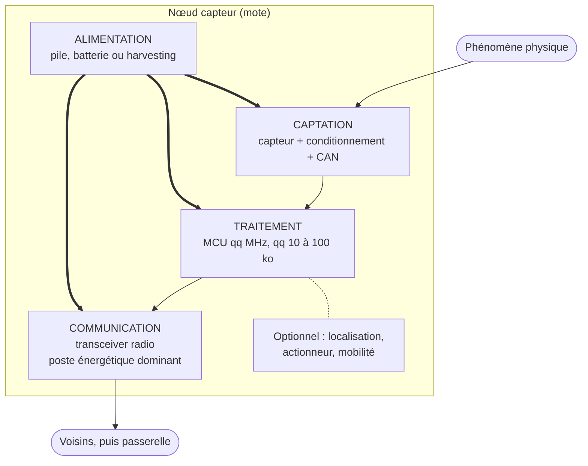

# Nœud capteur (mote)

> **Définition.** Système embarqué contraint constitué de quatre sous-ensembles fonctionnels : unité de captation, de traitement, de communication et d'alimentation.

Un nœud capteur (souvent appelé *mote*) comporte quatre briques : la captation (interface avec le monde physique), le traitement (microcontrôleur et mémoire), la communication (émetteur-récepteur radio, le composant le plus gourmand en énergie) et l'alimentation (batterie ou récupération d'énergie, qui conditionne la durée de vie de tout le nœud).

À cela s'ajoutent parfois un système de localisation (GPS ou méthode par la portée radio), un actionneur (vanne, relais), et un système de mobilité pour les nœuds embarqués.

## Schéma

Les flèches épaisses rappellent que l'alimentation irrigue les trois autres blocs : c'est elle qui fixe la durée de vie de l'ensemble, et c'est pourquoi le bloc de communication — le plus gourmand — commande toute la conception. La chaîne de la mesure, elle, va de haut en bas : captation, traitement, communication.

## Notions liées

- [[Réseau de capteurs sans fil (WSN)]]
- [[Unité de captation]]
- [[Unité de traitement]]
- [[Unité de communication (transceiver)]]
- [[Unité d'alimentation]]
- [[Nœuds fixes et nœuds mobiles]]

---
*Chapitre 1 — Introduction, architectures et applications. Cours [IM5RC] Réseaux de capteurs, MIRA 3A.*
