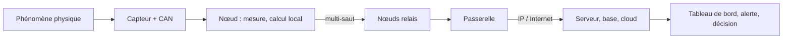

# Réseau de capteurs sans fil (WSN)

> **Définition.** Ensemble de nœuds capteurs autonomes, spatialement distribués, qui coopèrent pour mesurer des grandeurs physiques, traiter localement ces mesures, et les acheminer sans fil de proche en proche jusqu'à une passerelle.

L'idée centrale est celle d'une **instrumentation distribuée et communicante**. Là où la métrologie classique installe un capteur relié par câble à un enregistreur, le réseau de capteurs disperse l'intelligence : chaque nœud est à la fois un instrument de mesure, un petit calculateur et un émetteur-récepteur radio. Le réseau tire sa valeur non pas d'un capteur isolé, mais de la **densité** et de la **coopération** de nombreux nœuds couvrant une zone.

Le chemin type de la donnée : phénomène physique → capteur → nœud → (relais par d'autres nœuds) → passerelle → serveur/cloud → utilisateur.

## Schéma

Cette chaîne est aussi le plan du cours : le chapitre 1 décrit le nœud et la topologie, le chapitre 2 l'adressage qui rend chaque nœud joignable, le chapitre 3 le trajet multi-saut, le chapitre 4 ce qui permet à la chaîne de durer et de survivre aux pannes.

L'idée naît dans les années 1980 (surveillance militaire acoustique), puis se démocratise à la fin des années 1990 grâce à la miniaturisation des microcontrôleurs et des MEMS, à la baisse du coût des radios faible puissance, et à des OS embarqués dédiés (TinyOS, Contiki). La normalisation IEEE 802.15.4 (2003) puis l'essor du LPWAN (LoRaWAN, NB-IoT) l'inscrivent définitivement dans l'Internet des objets.

**À retenir.** Sur un nœud capteur, ce n'est pas le calcul qui coûte le plus cher en énergie, mais la communication radio. Une bonne conception cherche donc à calculer localement pour transmettre le moins possible : ce principe gouverne l'ensemble du cours.

## Notions liées

- [[Nœud capteur (mote)]]
- [[Passerelle (gateway)]]
- [[Topologie en étoile]]
- [[Topologie maillée (mesh)]]
- [[Topologie hiérarchique (clusters)]]
- [[Contraintes des réseaux de capteurs]]
- [[Domaines d'application des WSN]]
- [[Le fil rouge de l'énergie]]

---
*Chapitre 1 — Introduction, architectures et applications. Cours [IM5RC] Réseaux de capteurs, MIRA 3A.*
