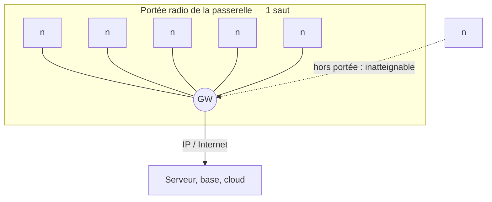

# Topologie en étoile

> **Définition.** Tous les nœuds communiquent directement avec la passerelle, en un seul saut (single-hop). La topologie la plus simple.

**Avantages** : simplicité, latence faible et prévisible, nœuds simples (pas de fonction de routage), consommation maîtrisée.

**Inconvénients** : portée limitée à la portée radio d'un nœud ; si la passerelle tombe, tout le réseau tombe (point unique de défaillance) ; passage à l'échelle limité.

C'est la topologie typique des réseaux LPWAN (LoRaWAN, NB-IoT), où chaque capteur atteint directement une antenne de plusieurs kilomètres de portée.

## Schéma

`n` : nœud capteur. `GW` : passerelle.

Chaque nœud atteint la passerelle **en un seul saut** : aucun nœud ne relaie le
trafic d'un autre. D'où les deux limites visibles sur le schéma — un nœud au-delà
de la portée radio n'a aucun moyen d'être raccordé, et la passerelle est le
**point unique de défaillance** par lequel transite tout le trafic.

## Notions liées

- [[Réseau de capteurs sans fil (WSN)]]
- [[Passerelle (gateway)]]
- [[LoRa et LoRaWAN]]
- [[Topologie maillée (mesh)]]
- [[Topologie hiérarchique (clusters)]]

## Mentionné par

- [[Bluetooth Low Energy (BLE)]]

---
*Chapitre 1 — Introduction, architectures et applications. Cours [IM5RC] Réseaux de capteurs, MIRA 3A.*
