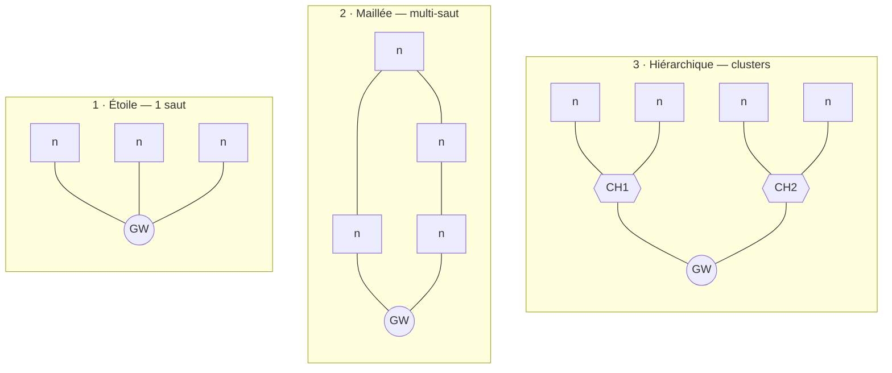

# Topologie hiérarchique (clusters)

> **Définition.** Les nœuds sont regroupés en clusters ; chaque cluster élit un chef de cluster (cluster head) qui agrège les données de ses membres et les transmet vers la passerelle.

**Avantages** : excellente efficacité énergétique (transmissions courtes distances, agrégation qui réduit le volume de données) ; bon passage à l'échelle.

**Inconvénients** : le chef de cluster se décharge plus vite, d'où la nécessité de faire tourner le rôle ([[LEACH]]) ; complexité de l'élection et de la maintenance des clusters.

Trois topologies de référence à connaître : **étoile** (simple, mono-saut, longue portée), **maillée** (robuste, multi-saut, dense) et **hiérarchique** (économe en énergie grâce à l'agrégation par clusters). Le choix découle de la zone à couvrir, de la portée radio et de la contrainte énergétique.

## Schéma

`GW` : passerelle. `CH` : chef de cluster. Les trois topologies sont numérotées pour fixer l'ordre de lecture. Elles n'ont pas le même point de fragilité — c'est le critère qui décide le plus souvent.

## Repères chiffrés

| Critère | Étoile | Maillée | Hiérarchique |
|---|---|---|---|
| Sauts | 1 | plusieurs | 2 (nœud → CH → GW) |
| Portée utile | celle d'un nœud | cumulée sur la chaîne | intermédiaire |
| Complexité du nœud | minimale | routage embarqué | élection de chef |
| Énergie | maîtrisée, mais émissions longue portée | les relais surconsomment | la meilleure, grâce à l'agrégation |
| Point unique de défaillance | la passerelle | aucun | le chef de cluster |
| Latence | faible et prévisible | variable | intermédiaire |
| Passage à l'échelle | limité | bon | très bon |
| Exemples | LoRaWAN, NB-IoT | Zigbee, Thread | LEACH |

## Notions liées

- [[Réseau de capteurs sans fil (WSN)]]
- [[Agrégation de données]]
- [[Topologie en étoile]]
- [[Topologie maillée (mesh)]]
- [[LEACH]]

---
*Chapitre 1 — Introduction, architectures et applications. Cours [IM5RC] Réseaux de capteurs, MIRA 3A.*
