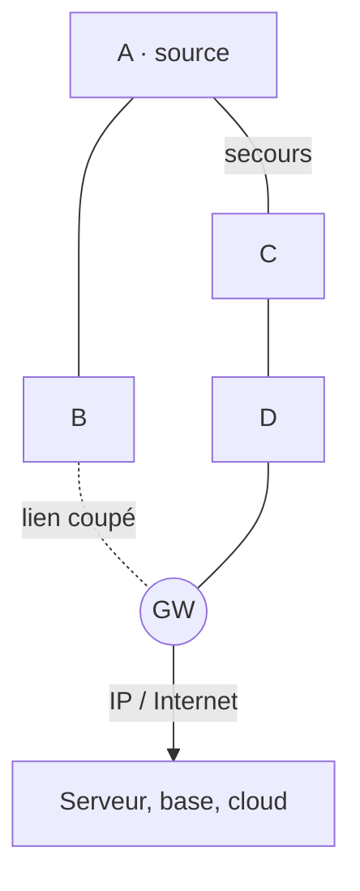

# Topologie maillée (mesh)

> **Définition.** Les nœuds peuvent relayer les messages les uns des autres. L'information chemine en plusieurs sauts (multi-hop) jusqu'à la passerelle.

**Avantages** : couverture étendue au-delà de la portée d'un seul nœud ; robustesse (si un chemin est coupé, un autre est trouvé) ; pas de point unique de défaillance.

**Inconvénients** : complexité (chaque nœud doit router) ; consommation accrue des nœuds relais ; latence variable ; protocoles de routage nécessaires.

C'est la topologie de Zigbee et de Thread, adaptée aux déploiements denses où la portée individuelle est faible mais la couverture globale doit être grande.

## Schéma

`A`, `B`, `C`, `D` : nœuds capteurs. `GW` : passerelle.

A est hors de portée de la passerelle : ses données
transitent par des nœuds relais, en **plusieurs sauts** — c'est ce qui étend la
couverture bien au-delà de la portée d'un seul nœud. Quand le lien B–GW tombe,
le trafic bascule sur A–C–D–GW : il n'y a **pas de point unique de défaillance**.
En contrepartie, chaque relais dépense son énergie pour le compte des autres et
la latence dépend du chemin retenu.

## Notions liées

- [[Réseau de capteurs sans fil (WSN)]]
- [[Zigbee]]
- [[Thread]]
- [[Réseau ad-hoc (MANET)]]
- [[Mécanismes de résilience]]
- [[Topologie en étoile]]
- [[Topologie hiérarchique (clusters)]]

## Mentionné par

- [[Tolérance aux pannes]]

---
*Chapitre 1 — Introduction, architectures et applications. Cours [IM5RC] Réseaux de capteurs, MIRA 3A.*
