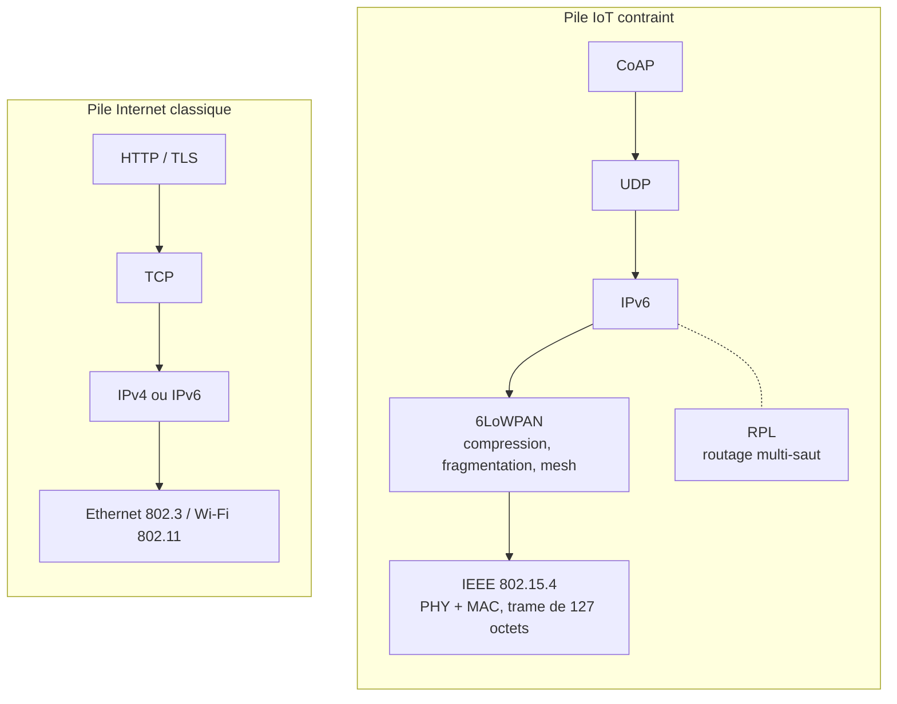

# Pile protocolaire de l'IoT contraint

> **Définition.** Empilement protocolaire typique d'un capteur IPv6 moderne : IEEE 802.15.4 → 6LoWPAN → IPv6 → UDP → CoAP, avec RPL pour le routage multi-saut.

**CoAP** (Constrained Application Protocol) est un équivalent allégé de HTTP pour objets contraints, transporté sur UDP plutôt que TCP pour rester léger. Cette pile complète illustre comment chaque couche résout un problème spécifique de la contrainte radio : la physique et la liaison (802.15.4), l'adressage compressé (6LoWPAN/IPv6), le transport léger (UDP), l'application (CoAP) et le routage vers la passerelle (RPL).

## Schéma

La mise en regard fait apparaître l'essentiel : **6LoWPAN est une couche en plus**, absente de la pile classique, insérée uniquement parce que le lien radio est trop petit pour IPv6. Trois autres substitutions suivent la même logique de frugalité — UDP au lieu de TCP, CoAP au lieu de HTTP, multicast au lieu de broadcast.

## Notions liées

- [[6LoWPAN]]
- [[IPv6]]
- [[IEEE 802.15.4]]
- [[RPL]]
- [[CoAP]]
- [[Couche MAC et accès au canal (CSMA-CA)]]

---
*Chapitre 2 — Adressage et protocole IPv6. Cours [IM5RC] Réseaux de capteurs, MIRA 3A.*
