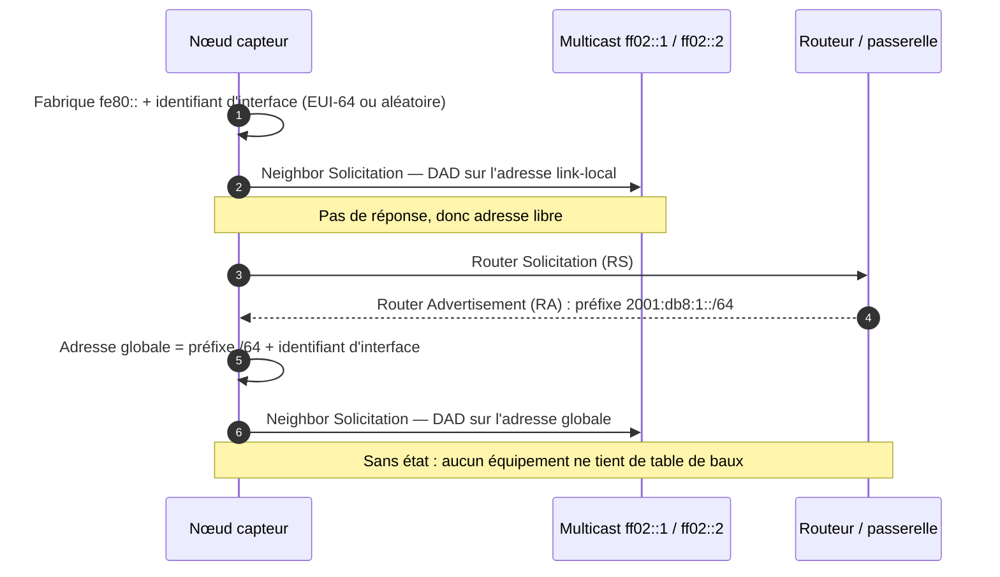

# SLAAC

> **Définition.** StateLess Address AutoConfiguration : mécanisme qui permet à un nœud de se fabriquer lui-même une adresse IPv6, sans serveur central.

1. Le nœud génère une adresse *link-local* et vérifie qu'elle n'est pas déjà utilisée (DAD, Duplicate Address Detection).
2. Il émet un message **Router Solicitation** (RS).
3. Un routeur répond par un **Router Advertisement** (RA) contenant le préfixe réseau (`/64`) à utiliser.
4. Le nœud combine ce préfixe avec son identifiant d'interface pour former son adresse globale.

Mécanisme « sans état » : aucun équipement ne tient de table des adresses attribuées, chaque nœud est autonome. Léger et bien adapté aux capteurs.

## Schéma

Deux points que la liste d'étapes ne montre pas et que le diagramme rend visibles : le DAD s'exécute **deux fois** — sur l'adresse link-local puis sur l'adresse globale — et l'essentiel du dialogue passe par des adresses de **multicast**, jamais par du broadcast.

## Notions liées

- [[IPv6]]
- [[Structure d'une adresse IPv6]]
- [[DHCPv6]]
- [[NDP (Neighbor Discovery Protocol)]]
- [[Types d'adresses IPv6]]

---
*Chapitre 2 — Adressage et protocole IPv6. Cours [IM5RC] Réseaux de capteurs, MIRA 3A.*
