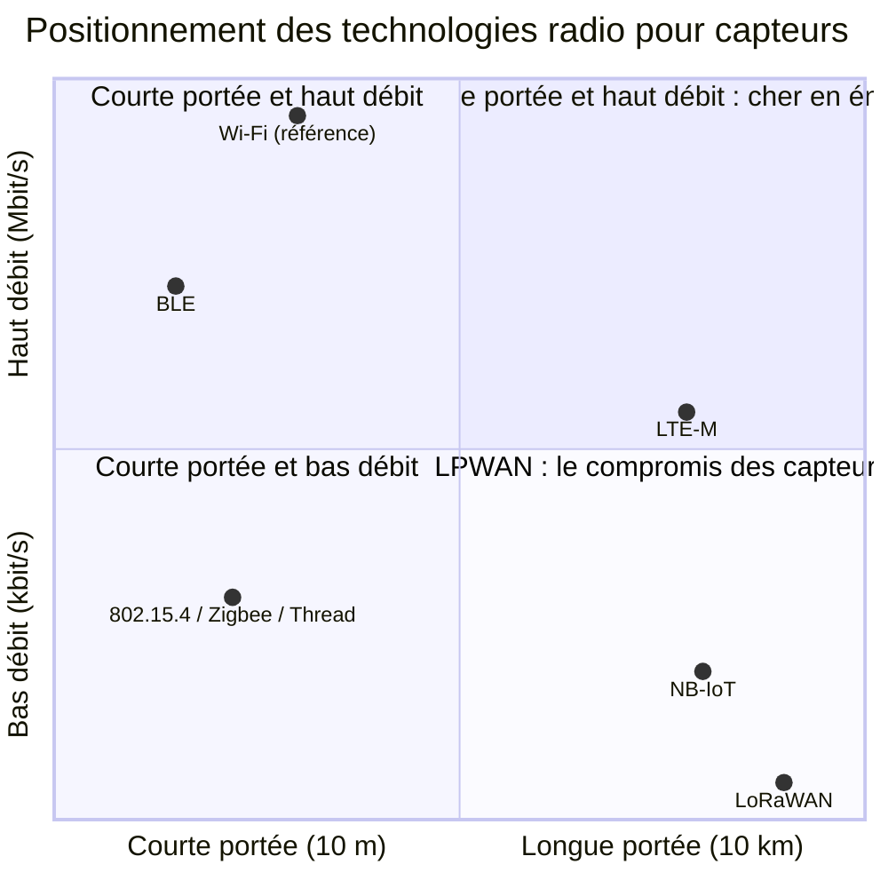

# Compromis portée-débit-consommation

> **Définition.** Toute communication sans fil repose sur un compromis entre portée, débit, consommation et coût, qu'on ne peut pas tous optimiser en même temps.

Augmenter la portée demande d'augmenter la puissance d'émission (donc la consommation) ou de baisser le débit (une modulation plus robuste transporte moins d'information mais porte plus loin). C'est pourquoi les technologies « longue portée » sont aussi « bas débit », et inversement : il n'existe pas de technologie universelle, on choisit en fonction du besoin.

## Schéma

Le quadrant en haut à droite — longue portée **et** haut débit — est vide pour les capteurs : y aller demande une puissance d'émission incompatible avec une pile. Les technologies de capteurs se répartissent donc sur les deux autres bords, et choisir revient à décider de quel côté on se place.

**Illustration chiffrée sur une seule technologie.** En LoRa, passer de SF7 à SF12 multiplie la portée mais fait tomber le débit de 5,5 kbit/s à 250 bit/s, et allonge le temps d'antenne d'un facteur d'environ 25 (62 ms à 1,5 s pour 20 octets). L'énergie par message suit : voir le calcul dans [[Budget énergétique d'un nœud]]. Le compromis n'est pas seulement un choix entre technologies, il se rejoue à l'intérieur de chacune.

**À retenir.** On ne peut avoir simultanément longue portée, haut débit et basse consommation. Toute technologie de communication pour capteurs est un point de compromis sur ce triangle. Choisir une technologie, c'est décider quelle grandeur on sacrifie.

## Notions liées

- [[Comparaison des technologies radio]]
- [[IEEE 802.15.4]]
- [[Bluetooth Low Energy (BLE)]]
- [[LoRa et LoRaWAN]]
- [[NB-IoT et LTE-M]]
- [[Budget énergétique d'un nœud]]

---
*Chapitre 3 — La communication dans les réseaux de capteurs. Cours [IM5RC] Réseaux de capteurs, MIRA 3A.*
