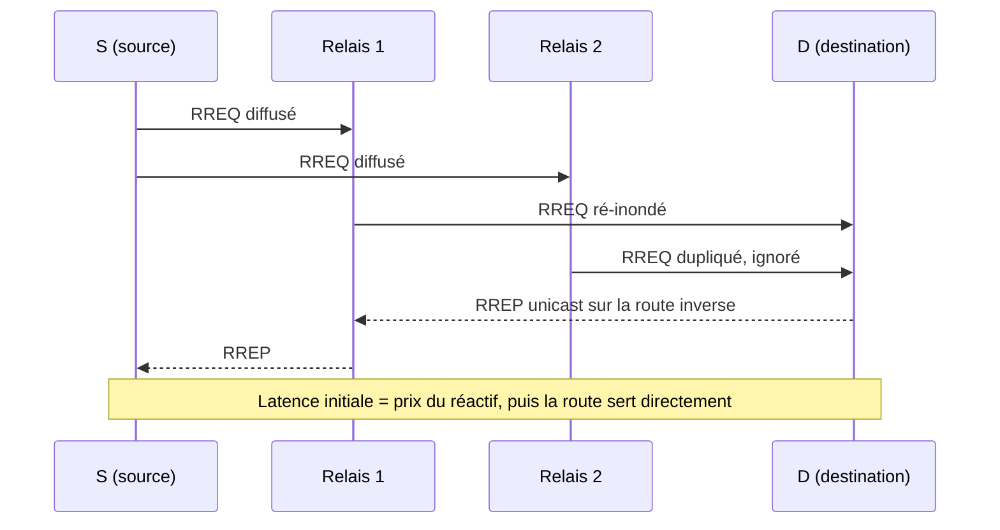

# Protocoles réactifs (AODV)

> **Définition.** Protocoles on-demand qui ne calculent une route que lorsqu'un nœud a effectivement quelque chose à envoyer.

La recherche de route se fait par inondation d'une requête (*Route Request*) jusqu'à atteindre la destination, qui répond (*Route Reply*). **Avantage** : pas de trafic de contrôle inutile en l'absence de communication, économe quand le trafic est sporadique. **Inconvénient** : latence initiale à chaque nouvelle route, l'inondation coûte de l'énergie. **Exemple : AODV** (Ad-hoc On-demand Distance Vector), qui ne conserve que les routes actives.

## Schéma

Le diagramme rend visibles les deux inconvénients annoncés : le RREQ atteint la destination par plusieurs chemins et une partie des copies est jetée — c'est l'énergie dépensée par l'inondation — et rien ne circule utilement avant le retour du RREP.

## Références

- RFC 3561 — AODV.

## Notions liées

- [[Routage dans les réseaux ad-hoc]]
- [[Protocoles proactifs (OLSR)]]
- [[Protocoles hybrides (ZRP)]]
- [[Nœuds fixes et nœuds mobiles]]

---
*Chapitre 3 — La communication dans les réseaux de capteurs. Cours [IM5RC] Réseaux de capteurs, MIRA 3A.*
