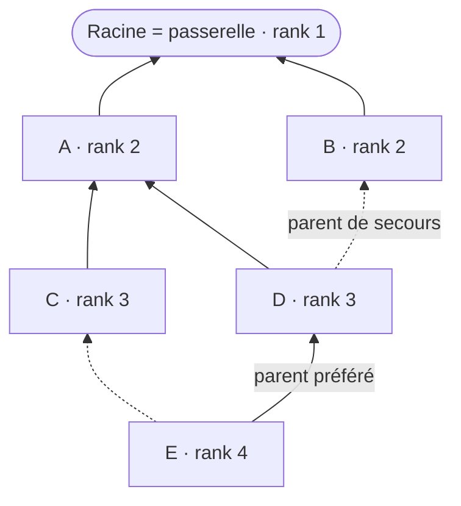

# RPL

> **Définition.** Routing Protocol for Low-power and Lossy networks : protocole de routage standardisé par l'IETF pour les réseaux IPv6/6LoWPAN contraints, organisé en arbre orienté (DODAG) enraciné sur la passerelle.

Chaque nœud choisit un « parent » vers la racine selon une fonction d'objectif (qualité de lien, nombre de sauts, énergie résiduelle). RPL est particulièrement adapté au schéma dominant des WSN, où l'essentiel du trafic remonte des capteurs vers la passerelle (arbre de collecte).

## Schéma

Trait plein : parent préféré, choisi par la fonction d'objectif. Trait pointillé : parent de secours, utilisé si le lien préféré se dégrade — c'est la redondance des chemins décrite dans [[Mécanismes de résilience]].

Le **rank** croît à mesure qu'on s'éloigne de la racine ; il interdit les boucles, puisqu'un nœud ne choisit jamais un parent de rank supérieur au sien.

## Les quatre messages de contrôle

| Message | Sens | Rôle |
|---|---|---|
| **DIO** — DODAG Information Object | descend de la racine | construit et entretient l'arbre, diffuse le rank et la fonction d'objectif |
| **DIS** — DODAG Information Solicitation | émis par un nœud | demande un DIO pour rejoindre un DODAG existant |
| **DAO** — Destination Advertisement Object | remonte vers la racine | installe les routes descendantes vers un nœud |
| **DAO-ACK** | descend | acquitte un DAO |

La diffusion des DIO est régulée par un **timer Trickle** : très fréquent quand la topologie bouge, il s'espace exponentiellement quand le réseau est stable — un mécanisme d'économie d'énergie à part entière.

Deux modes de fonctionnement : **storing**, où chaque routeur mémorise les routes de son sous-arbre, et **non-storing**, où seule la racine tient la table complète et insère un en-tête de routage source. Le mode non-storing économise la mémoire des nœuds, au prix d'en-têtes plus gros.

**Exemple.** Un réseau de prévention incendie composé de capteurs fixes remontant périodiquement des mesures vers une passerelle relève d'un routage de type arbre de collecte (RPL) ou d'une simple étoile LoRaWAN. Un scénario avec des drones de surveillance mobiles relève au contraire d'un routage réactif (AODV), car la topologie change à chaque passage.

## Références

- RFC 6550 — RPL.
- RFC 6552 — fonction d'objectif OF0 (nombre de sauts).
- RFC 6719 — fonction d'objectif MRHOF, qui utilise par défaut la métrique ETX.
- RFC 6206 — algorithme Trickle.

## Notions liées

- [[6LoWPAN]]
- [[Routage dans les réseaux ad-hoc]]
- [[Passerelle (gateway)]]
- [[Nœuds fixes et nœuds mobiles]]
- [[Mécanismes de résilience]]
- [[Qualité de lien (PRR, ETX, RSSI, LQI)]]
- [[Sécurité des réseaux de capteurs]]

---
*Chapitre 3 — La communication dans les réseaux de capteurs. Cours [IM5RC] Réseaux de capteurs, MIRA 3A.*
