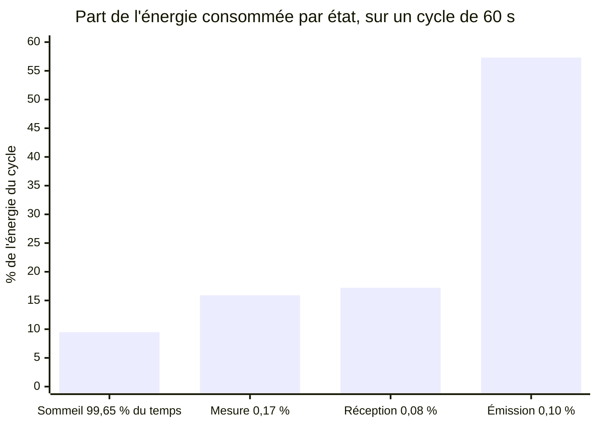

# Duty cycling

> **Définition.** Fait alterner le nœud entre un état actif (radio et capteurs allumés) et un état de sommeil profond, en maximisant le temps de sommeil. Le rapport cyclique (duty cycle) est la fraction de temps passée en état actif.

On cherche à rendre le duty cycle le plus faible possible (souvent bien en dessous de 1 %). La difficulté est la **coordination** : si un nœud dort, ses voisins ne peuvent pas lui parler — il faut synchroniser les réveils. Les protocoles MAC dédiés aux WSN gèrent ce problème par :
- **l'échantillonnage du canal** (*Low-Power Listening*) : réveil très bref à intervalles réguliers pour vérifier si quelqu'un veut parler au nœud ;
- **l'ordonnancement synchronisé** : les nœuds s'accordent sur des créneaux communs de réveil (S-MAC, ou [[TSCH]] — Time-Slotted Channel Hopping — utilisé dans l'industrie).

## Schéma

Les barres donnent la part de l'**énergie** ; l'étiquette sous chaque barre donne la part du **temps**. Lire les deux ensemble : le sommeil occupe 99,65 % du temps pour moins de 10 % de l'énergie, la radio 0,18 % du temps pour **74 % de l'énergie**. Les valeurs viennent du calcul détaillé dans [[Budget énergétique d'un nœud]].

C'est ce renversement qui justifie tout le chapitre : optimiser ce qui occupe le temps ne sert à rien, il faut optimiser ce qui consomme la charge.

**Le coût caché de la coordination.** Faire dormir un nœud ne suffit pas : il faut que l'émetteur sache quand il écoute. Le Low-Power Listening reporte le coût sur l'émetteur, qui doit envoyer un préambule assez long pour couvrir la période de réveil du récepteur. L'ordonnancement synchronisé supprime ce préambule mais exige une synchronisation d'horloges, donc un trafic de contrôle périodique. Il n'y a pas de repas gratuit — voir [[Couche MAC et accès au canal (CSMA-CA)]].

## Notions liées

- [[Budget énergétique d'un nœud]]
- [[Unité de communication (transceiver)]]
- [[Agrégation de données]]
- [[Récupération d'énergie (energy harvesting)]]
- [[Couche MAC et accès au canal (CSMA-CA)]]
- [[TSCH]]

---
*Chapitre 4 — Économie d'énergie et tolérance aux pannes. Cours [IM5RC] Réseaux de capteurs, MIRA 3A.*
