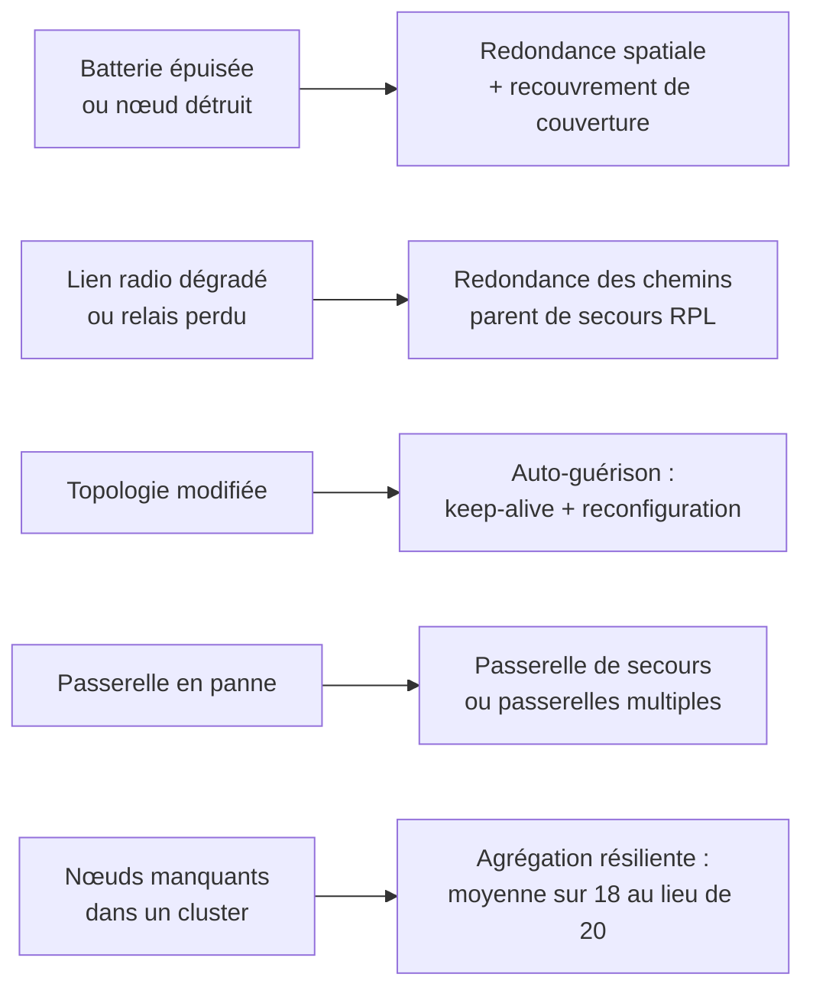

# Mécanismes de résilience

> **Définition.** Ensemble des parades qui permettent à un WSN d'encaisser la perte de composants : redondance spatiale, redondance des chemins, auto-guérison, redondance de la passerelle, agrégation résiliente.

- **Redondance spatiale** : déployer plus de nœuds que le strict minimum, avec recouvrement des zones de mesure, pour que la perte d'un nœud ne crée pas de « trou » de couverture. La parade la plus directe, au prix du surcoût matériel.
- **Redondance des chemins** : dans une topologie maillée, maintenir plusieurs routes possibles vers la passerelle. Si un relais tombe, le trafic bascule sur une route alternative — l'atout majeur du mesh sur l'étoile.
- **Auto-guérison (self-healing)** : le réseau détecte automatiquement la disparition d'un nœud (absence de réponse, *keep-alive* manquants) et réorganise ses routes ou reconstitue ses clusters sans intervention humaine. Les protocoles ad-hoc et RPL intègrent cette reconfiguration.
- **Redondance de la passerelle** : point critique du réseau ; on prévoit une passerelle de secours ou plusieurs passerelles pour les systèmes critiques (comme en LoRaWAN, où un même message peut être reçu par plusieurs gateways).
- **Agrégation résiliente** : concevoir l'agrégation pour qu'elle reste correcte même si quelques nœuds manquent (une moyenne sur 18 capteurs au lieu de 20 reste exploitable).

## Schéma — panne, puis parade

Lu de gauche à droite, le schéma est une grille de conception : pour chaque mode de défaillance identifié, une parade et son coût. Lu en masquant la colonne de droite, c'est un exercice.

**Ce que la résilience ne couvre pas.** Toutes ces parades traitent la panne **accidentelle**. Un nœud capturé et reprogrammé par un attaquant reste, lui, parfaitement vivant du point de vue du réseau : il répond aux keep-alive, il annonce des routes. L'auto-guérison ne le détectera pas — voir [[Sécurité des réseaux de capteurs]].

## Notions liées

- [[Tolérance aux pannes]]
- [[Topologie maillée (mesh)]]
- [[Passerelle (gateway)]]
- [[RPL]]
- [[Agrégation de données]]
- [[Réseau ad-hoc (MANET)]]
- [[Sécurité des réseaux de capteurs]]

---
*Chapitre 4 — Économie d'énergie et tolérance aux pannes. Cours [IM5RC] Réseaux de capteurs, MIRA 3A.*
